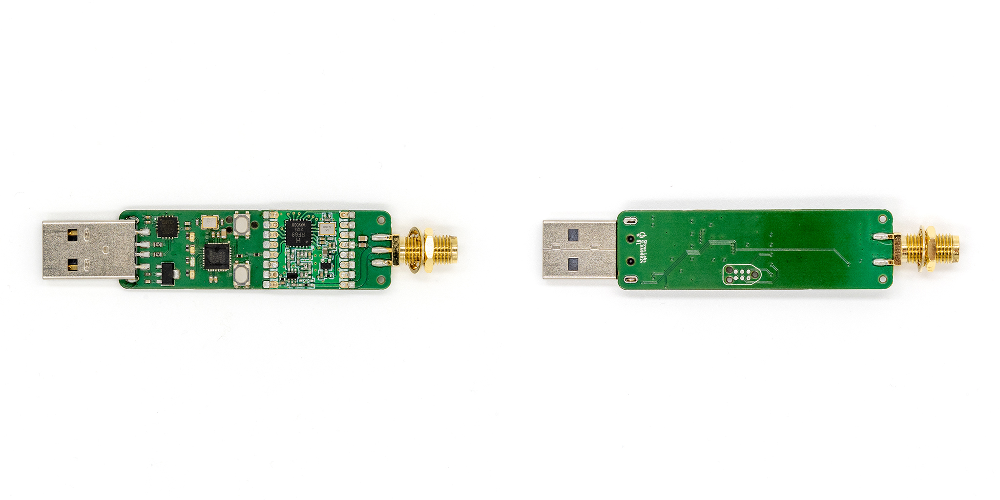

# MySensors RFM USB Gateway

This repository contains the open-source firmware for the MySensors RFM USB Gateway, a compact USB dongle designed for DIY IoT sensors.

[Buy Now](https://www.sitronlabs.com/store/mysensors-rfm-usb-gateway-254)

## Overview

The MySensors RFM USB Gateway can be plugged into any controller supported by MySensors to communicate with sensors using the same RFM radio. It serves as a bridge between your home automation controller and your wireless sensor network, enabling you to build a complete DIY IoT ecosystem.

## What is MySensors?

[MySensors](https://www.mysensors.org/) is an open source framework that simplifies building your own IoT sensors and actuators for home automation. It handles the low-level communication protocols so you can focus on your project's functionality. MySensors integrates with many popular home automation controllers including Home Assistant, Jeedom, Domoticz, OpenHAB, and more, making it easy to add custom devices to your existing setup.

This USB gateway is a compact device needed to interface your RFM69, RFM95 or RFM96 wireless sensors with any of the [supported controllers](https://www.mysensors.org/controller).

## Features

* Designed for [MySensors](https://www.mysensors.org/) with a RFM69 or RFM95/RFM96 (LoRa) radio
* Open firmware and schematic
* Compact USB form factor
* Plug and play with supported controllers
* Multiple radio frequency options (433MHz and 868MHz)
* FT230X USB-to-Serial IC with unique serial number for easy device identification in Home Assistant

## Building the Firmware

This project uses [PlatformIO](https://platformio.org/). To build and upload the firmware, open the project in PlatformIO IDE (VS Code extension), select the appropriate build environment from the toolbar based on your radio module (RFM69 or RFM95/96, 433 MHz or 868 MHz), then click "Build" to compile and "Upload" to flash the firmware to the module.
